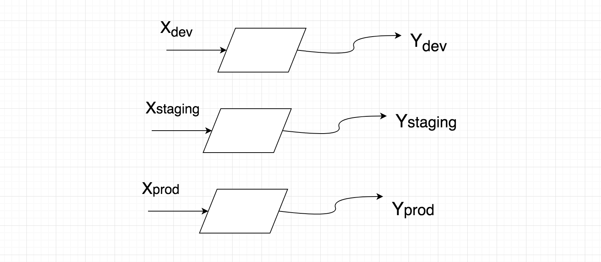
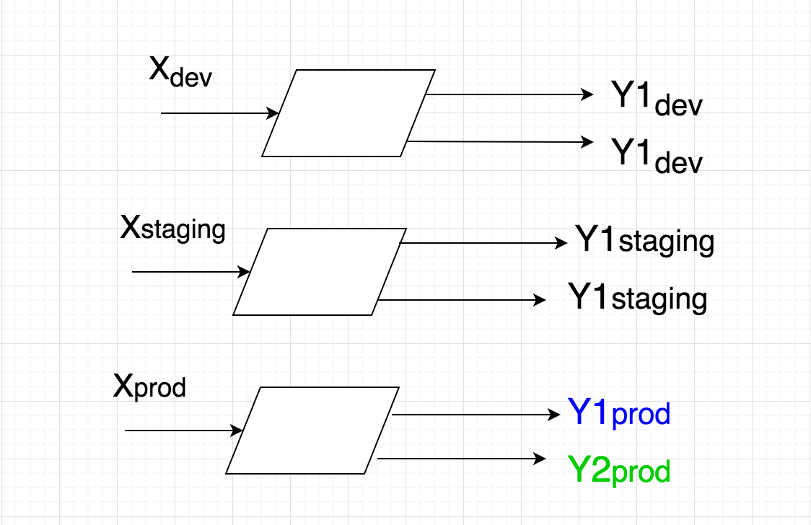

Wikipedia Defines Configuration(config) files as  --
"_files used to configure the parameters and initial settings for some computer programs. They are used for user applications, server processes and operating system settings._"

Before the applications serve the very first request, it is tested at various levels. Generally, the developers test it locally then it is deployed into development environment and then staging setup(pre-production) and then finally into production so that real users can use it.

We have three environments to configure, namely development(developers playground), staging(pre-production) and the production environment. Now we come up with a template and write a script to fill in values into the template. Everything works fine, until we realize configurations in development environment are poles apart from what is there in production environment. Now in order to not break the existing setup, we come up with brilliant hack. And believe me we want a solution to a problem not a hack.

### The Example

To understand the pains lets look at the configuration files of a reverse proxy (generally set up to load balance across servers).
In its configuration files, we mention if any request comes at X then proxy the request to an upstream server Y. Initially things are simple. We come up with a simple framework that only takes values of X and Y. The framework takes care of placing them properly in the configuration template.

With time things change and development setup looks completely different from production setup. Lets say your production requires weighted routing to two different endpoints, production configuration would be like if request comes in at X then proxy the request to Y1(50%) and Y2 (50%).

The development environment configuration remains same X to Y, Right?
This is how it looks. Someone new comes into the team, gets into the rev-proxy instance and opens the conf file and asks why is X points to same upstream server but twice. And then he comes to know about the framework.
The DRY (Do Not Repeat Yourself) principle is stressed so much in programmer community, that developers knowingly and unknowingly apply it (try apply it) everywhere. Unfortunately one size doesn’t fit all.

> one size doesn’t fit all.

Configurations are one such example, where we do not apply DRY. Lets keep things simple.

> Configurations are always declarative.

Configurations are always declarative and they are meant to be so. If you look into kubernetes deployments or any other kubernetes resource, it follows a declarative approach. The configurations in apigee are declarative as well. Its us, we deliberately put imperative layers on top of it and make it difficult and more complex to understand the system underneath.

### The Solution
Configurations are as critical as the application or the system itself. Its really important to keep the configurations predictable, it becomes easier to debug. Keep configurations declarative, have different declarations(config files) for different setup.
What do I mean by declarative approach? In declarative approach one defines the desired state, its up to the system underneath to make sure that the desired state is achieved.
