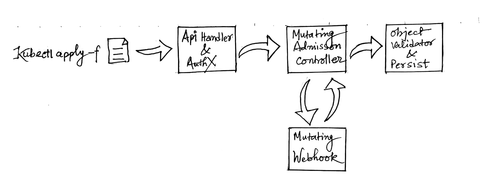
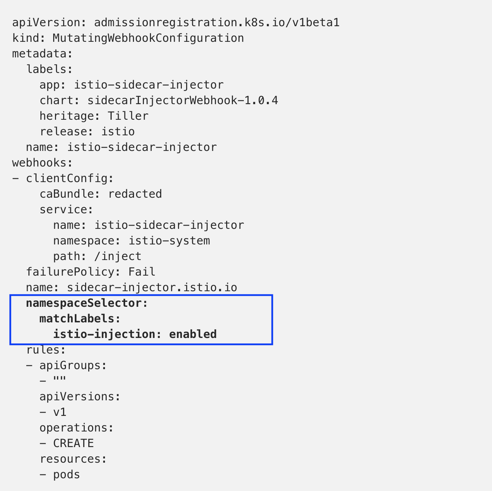
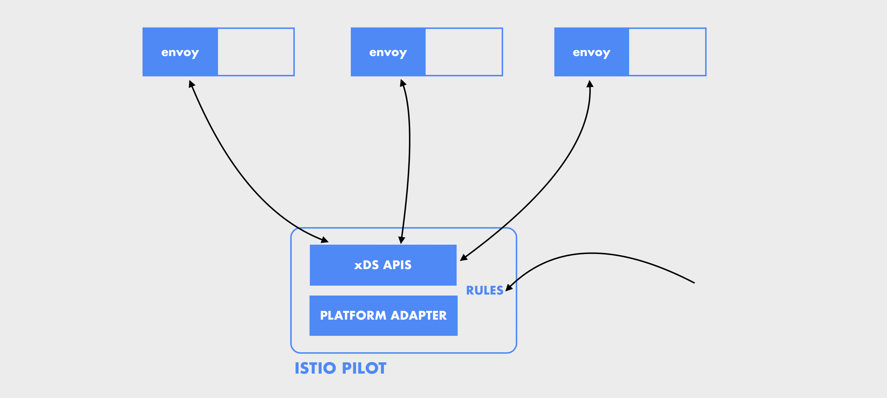
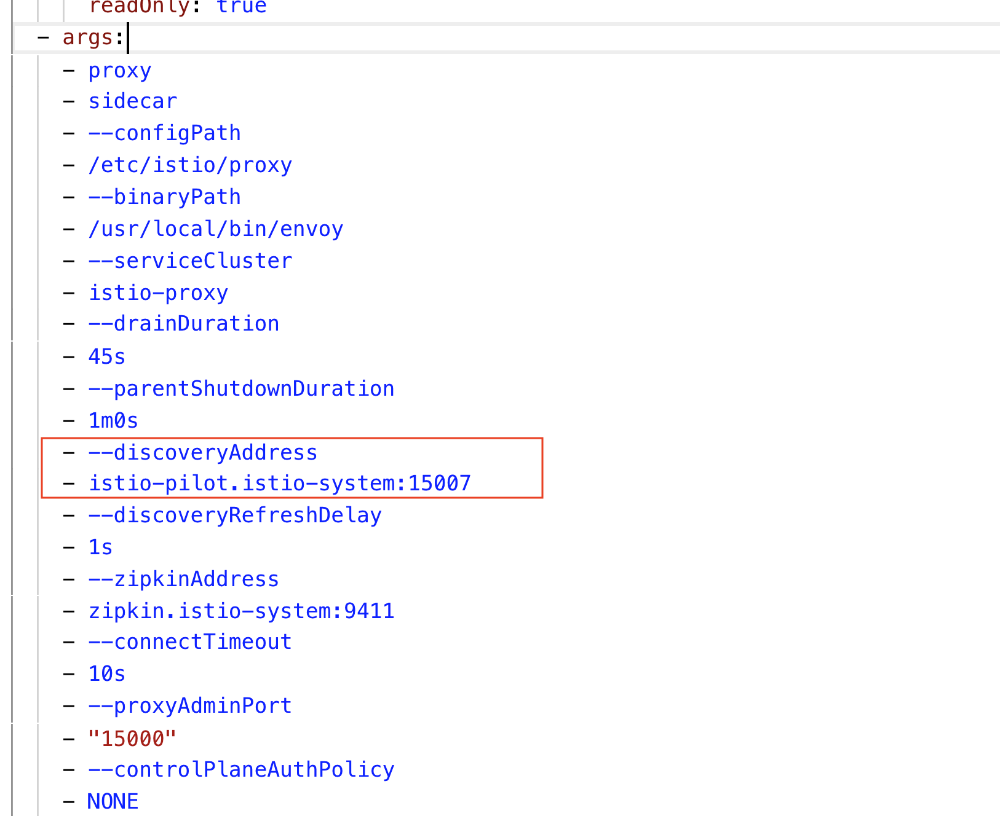
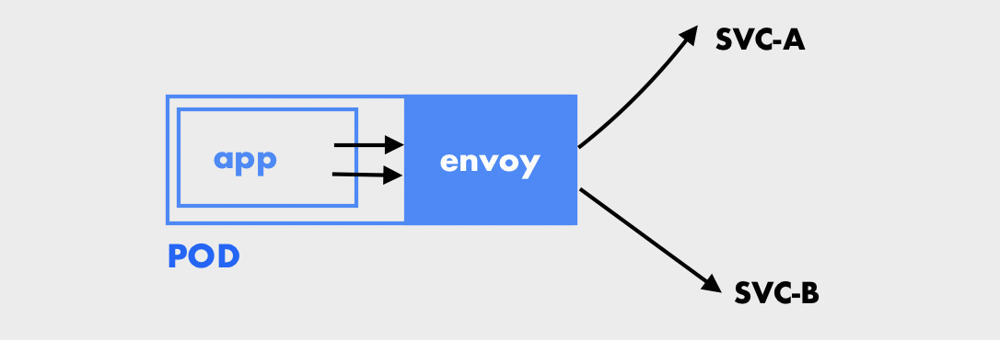
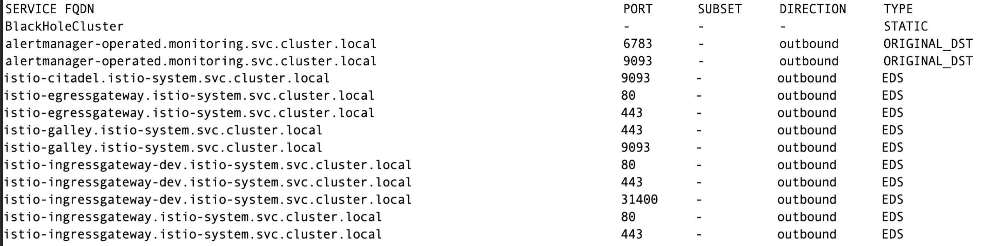

Kubernetes is a beast by itself containing lots and lots of terminology and its architecture underneath. Now adding Istio on top of it, life is not getting easier either unless you are the Rick of kubernetes. In fact, it makes life a lot harder. Well, why Istio then?

Service mesh is a network of communication trails among different microservices. Or consider it as a dedicated infrastructure for handling service-to-service communication. And istio is one of them. If one looks at istio from 10000 feet it is coordination among **Data Plane and Control Plane**.


Data Plane controls and circulates data within and out of the mesh. In its true form, it’s an [envoy](https://www.envoyproxy.io/) proxy (`nginx` can also be used here) which intrudes into all the inbound and outbound calls to the application and collects relevant metrics — latency, retries etc.
Control Plane directs the data plane. It manages various configurations/settings. If you look into the master-slave analogy control plane performs the tasks of masters. Cluster administrator configures the control plane in a declarative fashion.

If we look at the component level, it has `Mixer`, `Pilot`, `Citadel`, `Galley`.<br/>
**Mixer** and **Pilot** are of utter importance even if istio is used in its vanilla form. [This](https://istio.io/docs/concepts/what-is-istio/#why-use-istio) summarizes why you might want to use istio, but also keep in mind that istio is a relatively young project if not in its infancy.

#### Container Injection
Earlier in this post, we saw data plane consists of envoy proxies running alongside the application containers(sidecar) in every application pod. Such a setup can be achieved via explicitly specifying the envoy proxy in the pod template or by enabling auto-injection, i.e. istio automatically injects the envoy proxy container inside the application pod. Here we will see how auto-injection happens.

Whenever `kubectl apply -f resource.yaml` is executed, the resource passes through various stages(as depicted in the diagram below) before getting persisted to the etcd cluster.


Istio uses some of these stages to intercept the request to API-server and injects the sidecar proxies. To be precise, it configures a webhook into the mutating [admission controller](https://kubernetes.io/docs/reference/access-authn-authz/admission-controllers/).

If istio is already configured inside the kubernetes cluster you can get the `mutatingwebhookconfiguration` used for configuring the injector webhook into the Mutating Admission controller.

```
$ kubectl get mutatingwebhookconfiguration
NAME                     CREATED AT
istio-sidecar-injector   2018-12-06T05:29:22Z
```

Let's look into the configuration itself.

```
$ kubectl get mutatingwebhookconfiguration istio-sidecar-injector -o yaml
```


**NamespaceSelector** decides whether to run the webhook on an object based on whether the namespace for that object matches the selector. Rules describe what operations on what resources/subresources the webhook cares about. The webhook cares about an operation if it matches any Rule. [1]

The above MutatingWebhookConfiguration configures the webhook to be active only for namespaces labeled with istio-injection asenabled. To label a namespace with instio-injection=enabled execute the following command.

```
$ kubectl label ns namespaceName i
```

If you look into rules, it says for the core APIs (apiGroup = “”) with version v1 and for the CREATE operation of pods triggers the webhook with service `istio-sidecar-injector.istio-system.svc.cluster.local` .

For everything to work properly the following admission controllers have to be enabled.
```
...
  admissionControl:
    — NamespaceLifecycle
    — LimitRanger
    — ServiceAccount
    — PersistentVolumeLabel
    — DefaultStorageClass
    — DefaultTolerationSeconds
    — MutatingAdmissionWebhook
    — ValidatingAdmissionWebhook
    — ResourceQuota
    — NodeRestriction
    — Priority
```

From Kubernetes 1.3 onwards these admission controllers are by default enabled. For more information follow [this page](https://istio.io/docs/setup/kubernetes/platform-setup/aws/).

#### setup
Istio documentation has listed various ways of installing istio inside kubernetes cluster. All the methods are very detailed and crisp. We have tried a couple of ways mentioned in the documentation and found helm to be more fluent than others. Following the instructions (listed in for helm) just does the job, but it does not install certain components like prometheus, kiali, jaegar(distributed tracing — one of the cool things). One would have to change the values.yaml file located at install.kuberntes.helm.istio of the zip download, in order to harness the complete package of offerings from istio.

```
$ kubectl get deploy -n istio-system
NAME                     DESIRED   CURRENT   UP-TO-DATE   AVAILABLE  
grafana                  1         1         1            1         
istio-citadel            1         1         1            1
istio-egressgateway      1         1         1            1          
istio-galley             1         1         1            1          
istio-ingressgateway     3         3         3            3           
istio-pilot              1         1         1            1
istio-policy             1         1         1            1           
istio-sidecar-injector   1         1         1            1          
istio-telemetry          1         1         1            1          
istio-tracing            1         1         1            1           
kiali                    1         1         1            1           
prometheus               1         1         1            1
```

We were evaluating istio in our dev environment and found few basic flaws like deleted pod ips not getting cleared from mesh[2], and grafana dashboard wouldn’t come up due to security context of the volume which was changed accordingly in later releases of istio. Now it is very stable in istio-1.0.5. Due to the basic flaw in routing in its initial releases, it made us suspicious for every other release we tried.

#### Some Envoy Basics

All the traffic in and out of the service mesh transits through the envoy proxies. Thus a basic understanding of envoy is a must. Unlike traditional proxies where the configuration is picked from a conf file while starting the proxy process, envoy configuration is driven at runtime via discovery services([xDS](https://github.com/envoyproxy/data-plane-api/blob/master/XDS_PROTOCOL.md) APIs). These discovery services are implemented by the control plane — here the istio pilot. All the routing configurations are delivered to the envoy proxies seamlessly on top of the grpc protocol.

Since the configuration is driven at runtime, the envoy proxies are configured with xDS APIs which are implemented by the istio proxy. If you peek into the kubernetes object definition of one of the pods inside the mesh you would find something like `--discoveryAdress istio-pilot` in the command arguments of the envoy proxy container.

```
$ kubectl get pod istio-mesh-pod -o yaml
```



Envoy proxies continuously ask the pilot for new configuration details. Since there is an external call associated with it, the routing configurations are eventually consistent. For the configuration which we have used, envoy queries the xDS APIs every 1s (which is the default value in istio configurations).

----

It is important that we familiarize ourselves with terminologies used in envoy in order to understand its configurations even better.


**Host** is a network entity. `app` in the above diagram making an outbound request through the proxy is the **downstream** host and the pods/hosts accepting these requests behind service-A and service-B are **upstream** hosts. **Listeners** are named network locations (like port) that can accept requests from **downstream** clients. The listeners can be viewed `./istioctl proxy-config listeners pod-name -n namespace` . istioctl comes with the istio.zip under the bindirectory. **cluster** is a group of similar upstream servers. For us, every kubernetes service and service entry is a different cluster as there will be a herd of pods behind every service/serviceEntry.

```
$ istioctl proxy-config clusters pod-name -n namespace
```


For any request from the downstream hosts, based on the port, protocol a listener is invoked which takes the request through a chain of filters, one of it is the route where envoy evaluates the cluster where the request can be sent which finally reaches an endpoint under the chosen cluster.


Coolest features Envoy offer: tracing, timeout, [retires](https://www.envoyproxy.io/docs/envoy/latest/intro/arch_overview/http_routing#retry-semantics). Envoy can be configured to retry a network call n number of times on certain type of errors.

Envoy has a lot of other things and I have thoughts around exploring and learning more, maybe I will say more about envoy in a separate blog post.

**Some Useful Commands** <br/>
The following commands come handy while debugging and looking for current configurations of the proxies.
- In order to access the envoy management panel from a local browser `kubectl port-forward podName 15000 -n namespace` . Envoy proxies listen on port 15000(default-port for envoy).
- In order to list the listeners `./istioctl proxy-config listeners pod-name -n namespace`. To get more details, append -o json in the same command.
- In order to list the clusters `./istioctl proxy-config clusters pod-name -n namespace`
- `./istioctl proxy-config routes pod-name -n namespace -o json` gives a detailed view of the routes.
- `./istioctl proxy-config endpoints pod-name -n namespace -o json` for listing endpoint information under different clusters.

<center> * * * </center>
In the next post, we will have a closer look into istio pilot and traceability & observability aspects offered by istio.

<center> * * * </center>

#### Useful reads
- https://banzaicloud.com/blog/k8s-admission-webhooks/
- https://github.com/envoyproxy/data-plane-api/blob/master/XDS_PROTOCOL.md
- https://blog.envoyproxy.io/the-universal-data-plane-api-d15cec7a
- https://www.envoyproxy.io/learn/routing-basics


[1]: https://v1-11.docs.kubernetes.io/docs/reference/generated/kubernetes-api/v1.11/#mutatingwebhookconfigurationlist-v1beta1-admissionregistration-k8s-io
[2]: https://github.com/istio/istio/issues/9480
