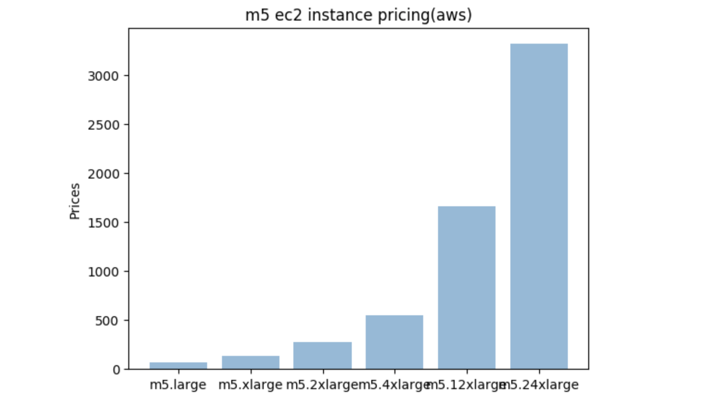
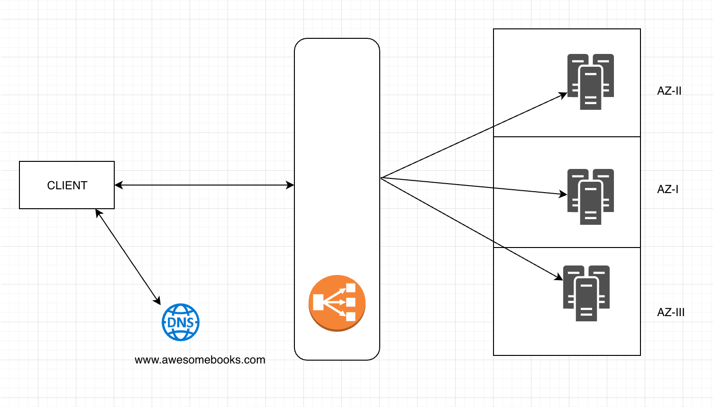
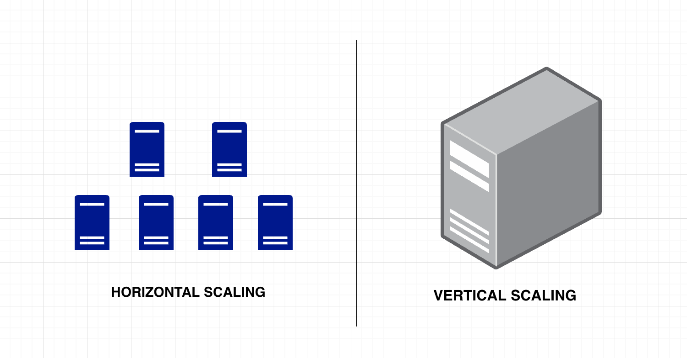

Proper understanding of scaling principles is of utmost importance for designing large scale systems. There already is a vast amount of resources on scaling and load balancing, available on the web in the form of text and video, and this one is merely a compilation of a few of those.

We, humans, are storytellers, we understand and remember stories better. In this post, we will peek into a story explaining the stuff around scaling. The story features two main characters, Bob and Alex. They both are avid readers and has already stacked up lots and lots of books. Read ’em all. One fine evening they noticed the book stacks and a brilliant idea clicked their thinking, why don’t we rent the books and charge a little. This way the earnings can be invested in buying new books (capitalists :):P). As Bob and Alex, both are famous for their coding abilities (they are everywhere, in codechef, spoj :D), they coded and launched their website in a few months. And their architecture looked something like this. A single a5.large (they knew t2 instances are burstable, not suitable for production.) aws ec2 instance running the application(listening on port 443 — already secure) and a DNS entry in the `route53`.

They knew they are in the internet era. Thus their application can reach huge numbers of concurrent users. The existing system cannot sustain more than a few hundreds of users. They had to come up with a solution quickly. Their growth numbers were unprecedented. The active users of their website grew so rapidly that the existing application cannot be re-written in a resource-conscious fashion. They decided to get a bigger machine(probably `m5.4xlarge` ) and redeploy their existing code in the new machine. This is called Vertical Scaling.

Alice and Bob soon realized that there is a ceiling to the vertical scaling — a machine cannot have resources beyond a certain threshold even if it could, it would be on the cost of an unrealistic number. The numbers in aws pricing chart suggest that the cost follows a linear path for computation but after a certain threshold, it would be like this.

Thus they were sure of the fact that at some point, sooner or later they have to think of scaling their application **Horizontally**. So they hired more engineers to change their architecture which can scale horizontally and it looked somewhat like below and it worked quite well.

Their company awesomebooks Pvt Ltd. grew and grew and made quite a profit. The end :)

* * * 

I hope you liked the little story and could get the essence of the two different scaling procedures.

Given that we already have the gist of scaling, let us look into horizontal and vertical scaling again and a few things around them. So that we understand the difference between two and identify what suits best to our requirements.

**Vertical Scaling** 
Increasing the capacity of a single machine by adding more resources(more processing power, more memory ) to it. One thing to remember here — “there is a ceiling to it”.

**Horizontal Scaling** 
Horizontal scaling means that you scale(enlarge) by adding more machines into your pool of resources. The same application runs on different systems and each having the capability of serving user requests. Distributed Databases, sharded databases, clustered setups are some of the famous brainchildren of horizontal scaling policy.

The question arises now is — Which backend server does the client request to? This leads us to load balancing. Load balancing is nothing but the distribution of incoming requests to one of the backend servers(systems).

Multiple IP addresses are associated with a single domain, clients are given IP in round robin fashion. This is called round-robin DNS load balancing and it works pretty well for stateless applications except for the fact that few requests might fail because of server downtime(the selected server might crash). Even if we have a mechanism to frequently update the DNS entry with the updated server IPs, the problem prevails because of the eventuality in the consistency of DNS. Is that all? If we look into the HTTP clients most of them cache the domain IPs, which can create a hotspot(a single server getting most of the requests) in the servers. In short, you can think of DNS as a wonderful LoadBalancer but without health check.

Now the question is — which among these two performs better? It is quite intuitive to think of L4 load balancers are more performant over L7 load balancers. However, L7 load balancers can lead to better overall efficiency if the requirement of your application dictates so.

I remember one of my colleague mentioning sophisticated & high performing hardware load balancers. Due to their expensive prices, most of the load balancers used today are software load balancers running on commodity hardware.

One of the essential requirements for building a scalable system where the load is distributed by a load balancer is to have health endpoint. This health endpoint(not necessarily HTTP endpoint) is used by the load balancer repeatedly to determine the active pool of servers. If the response from a server is failed one then the server is marked as a failed server and no request is routed to the failed server.

Now that we have little understanding of load balancers operating at different layers of the OSI model, let’s have a look at some of the common ways of that a server is chosen for a request. One of the very simple strategies would be to choose randomly from the active pool of servers but it might create hotspots thus not used. Or choose a server in a round-robin fashion. This is the default algorithm used by nginx while load balancing. Least connections(one of the algorithms often used) — requests are sent to the server having the least number of active connections.

Load balancing is not limited to the servers, load balancing can happen from the client side as well. The task of choosing a particular server is offloaded to a smart client. The client gathers all the backend servers from a set of bootstrapped hosts and picks one of them. This is called **client-side load balancing**. This is predominantly used for clustered setups (distributed systems). For example, redis client trying to perform “GET key” operation to a redis cluster.

#### It's a bit sticky
Even though HTTP is a stateless protocol(separate TCP connection initiation — a three-way handshake and TCP connection closure for every HTTP request), many application might need to store information to serve logged in users in a completely different way than a new user. For example, not so long ago most of the websites used to maintain their sessions in the server and consider this happening in a server behind a load balancer. If the request is distributed to a different server altogether, the user will be served with different content as the server doesn’t have any previous communication stored in its cache. Such scenarios require session persistence([sticky sessions](https://stackoverflow.com/questions/10494431/sticky-and-non-sticky-sessions)) feature from the load balancers.

It can be dealt in a different way, creating a cache cluster(centralized cache — redis in clustered setup) altogether, making the application stateless thereby request distribution less complex at the load balancer. Authentication has always been a stateful affair for a long time until the birth of JWT tokens. The reason that the JWTs are revolutionary is that it makes the application stateless. It is no brainer why stateless applications are so easy to scale horizontally.

#### One more moving part
We like our applications to run as expected but there is no justice, the wrath of network failure, system crashes are inevitable. Think of the initial architecture used by Bob and Alex in the story before, for their business wherein they had a single server catering to all the requests. This is certainly not a highly available system. The server goes down/crashes and all of a sudden the users of their website can’t access it.

When they added more application nodes by placing a load balancer in front of the servers, they ensured the reliability and availability of their website, if a server crashes, the requests will no longer be routed to the failed server. But what if the load balancer itself crashes, after all, the load balancers are running in some system. What then? Did we really mitigate the problem of `single point of failure` appeared in vertical scaling? If yes how? Generally, load balancers work in a clustered(or simply group of instances) setup, if one fails others instances in the cluster own the responsibilities of the failed instance.

Traceability and Observability are key for any successful application. Now given that applications are running in different instances(systems), it’s quite a hard job to figure out which server served a request and debug it without any sophisticated log aggregator or monitoring tool. The requests might very well fail at the load balancer itself. By introducing a load balancer, a new moving part is added in the whole application. Thus, it needs to be monitored as well.

#### Questions we ask ourselves
Getting back to the discussion on scaling, applications of different kinds have to be scaled differently. Before designing(deciding) the architecture, some of the questions that we need to ask ourselves — what communication protocol is used by our application? is our application stateless? do they talk to each other? if they do — what if one of the nodes (application instance) goes down(common scenario — has to be handled in all the distributed data stores)? What level of consistency is expected out of the system? How available should our application be?

 * * * 

Since we were talking about scaling, I was tempted to talk about containers(docker, lxc, etc.) as containers add a different dimension to the thought process on scaling. You can follow my post on containers [here](https://chandan.xyz/why-containers/).

 * * * 

**References & Resources**
- https://www.nginx.com/resources/glossary/layer-4-load-balancing/
- https://www.nginx.com/resources/glossary/layer-7-load-balancing/
- https://stackoverflow.com/questions/10494431/sticky-and-non-sticky-sessions
- https://www.nginx.com/resources/glossary/reverse-proxy-vs-load-balancer/
- https://serverfault.com/questions/309622/what-is-a-glue-record
- https://en.wikipedia.org/wiki/Load_balancing_(computing)
